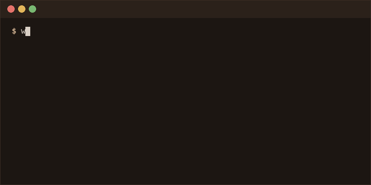

  

 

<b>What I'm building</b>

 

**SOC Homelab** — *personal, ongoing*
Deployed a Wazuh SIEM from scratch on an isolated KVM lab, instrumenting a Windows 11 endpoint with layered telemetry (Sysmon, audit policy, PowerShell logging). Ran 13 MITRE ATT&CK techniques across 6 tactics via Atomic Red Team to measure real detection coverage, then authored and paired-validated custom Wazuh rules — including catching LSASS credential dumping and ransomware-precursor shadow-copy deletion — while fixing false positives in stock rules along the way.
[github.com/saahithimukala10-gif/soc-homelabs](https://github.com/saahithimukala10-gif/soc-homelabs)

**SOC Pipeline — Prompt-Injection Resistance in Automated Triage** — *4-person research project*
Owned the evaluation harness for a team research project testing whether LLM-based SOC alert triage can be manipulated by prompt injection. Ran multi-model inference (Qwen 2.5 7B via Ollama, Gemini via API) against clean and poisoned MITRE ATT&CK alert variants, measuring attack-success rate, triage precision/recall, and false-negative rate across models — feeding into a team paper targeting IEEE/Scopus.

**CloudChain** — *team project, contributor*
Attack-path-aware CSPM for AWS — models resources as a dependency graph to find realistic attack chains to `AdministratorAccess` instead of flagging isolated misconfigurations. Implemented read-only path validation and risk scoring; backed by 194 tests and CI/CD.
[github.com/threetheodrummer/CloudChain](https://github.com/threetheodrummer/CloudChain)

**Kernox** — *group project*
An eBPF-based EDR platform monitoring Linux endpoints in real time. Built the React/TypeScript visualization layer surfacing alerts and suspicious-behavior signals from the backend correlation engine, plus supporting API work.
[github.com/HrishiK1107/Kernox](https://github.com/HrishiK1107/Kernox)

<b>Certifications & hands-on labs</b>

 

<table>
  <tr>
    <td align="center" width="200">
      <a href="https://www.credly.com/badges/bf3ea16c-9b06-457c-9607-bcc766c9216c/linked_in_profile">
         
        <b>ISC2 Certified in Cybersecurity (CC)</b>
      </a>
       Certified since 2026
       <a href="https://www.credly.com/badges/bf3ea16c-9b06-457c-9607-bcc766c9216c/linked_in_profile">Verify</a>
    </td>
    <td align="center" width="200">
      <a href="https://tryhackme.com/certificate/THM-1KX2MU7LIC">
         
        <b>TryHackMe — Pre Security</b>
      </a>
       Completed 25 Aug 2026
       <a href="https://tryhackme.com/certificate/THM-1KX2MU7LIC">Verify</a>
    </td>
    <td align="center" width="200">
       
      <b>TryHackMe — SOC Level 1</b>
       In progress — still waiting...
    </td>
  </tr>
</table>

CTF write-ups: Bandit, Natas, Krypton, Leviathan (OverTheWire), plus TryHackMe rooms — [github.com/saahithimukala10-gif/ctf-writeups](https://github.com/saahithimukala10-gif/ctf-writeups)

 

## Tech & Tools

Python · Flutter · FastAPI · React · TypeScript · MongoDB · SQL · Docker · Wazuh · AWS · Linux

 

## Connect

  
  

<i>Open to opportunities and conversations in cybersecurity, software development, and beyond.</i>

